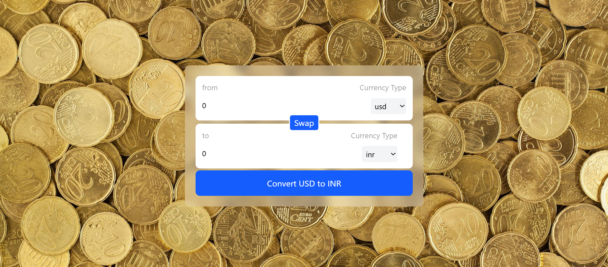

# Currency Converter

A modern, responsive currency converter web application built with React. Instantly convert between multiple currencies using real-time exchange rates.

## Features

- **Live Exchange Rates:** Fetches up-to-date currency rates from a public API.
- **Intuitive UI:** Clean, user-friendly interface with responsive design.
- **Swap Functionality:** Easily swap source and target currencies.
- **Multiple Currencies:** Supports a wide range of global currencies.
- **Instant Conversion:** Real-time calculation as you enter values.

## Screenshots



## Getting Started

### Prerequisites

- [Node.js](https://nodejs.org/) (v14 or higher recommended)
- [npm](https://www.npmjs.com/) 

### Installation

1. **Clone the repository:**

   ```bash
   git clone https://github.com/yourusername/currency-converter.git
   cd currency-converter
   ```

2. **Install dependencies:**

   ```bash
   npm install
   ```

3. **Start the development server:**

   ```bash
   npm run dev
   ```

4. Open [http://localhost:3000](http://localhost:3000) to view the app in your browser.

## Usage

1. Enter the amount you wish to convert.
2. Select the source and target currencies.
3. Click **Convert** to see the converted amount.
4. Use the **Swap** button to quickly switch between currencies.

## Project Structure

```
src/
  components/
    InputBox.jsx
    index.js
  hooks/
    useCurrencyInfo.js
  App.jsx
  index.js
```

## Technologies Used

- React
- JavaScript (ES6+)
- Tailwind CSS (for styling)
- [Fawaz Ahmed Currency API](https://github.com/fawazahmed0/currency-api)


